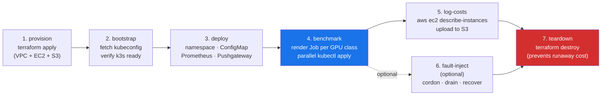
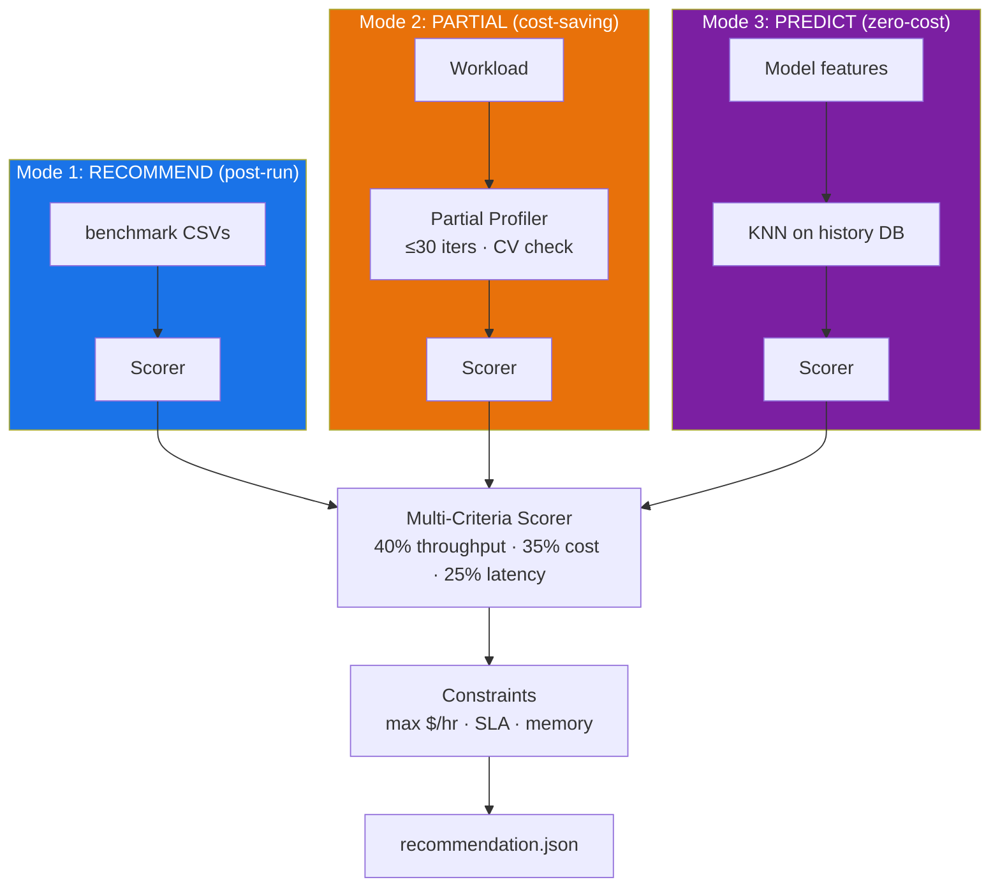
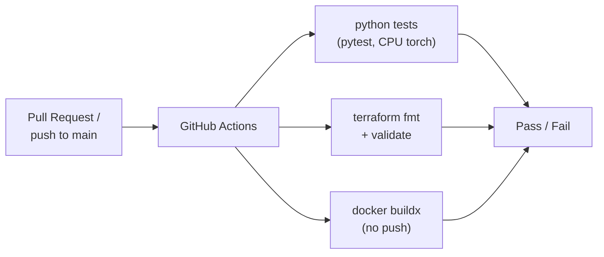
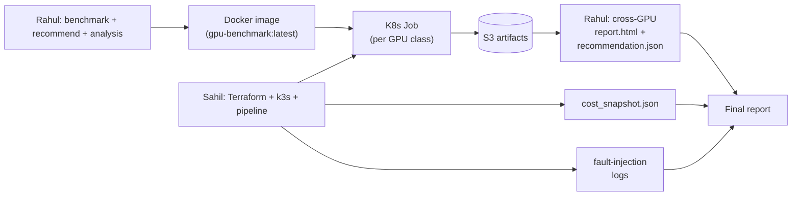

# Project Progress Report

**Project:** Containerized, Reproducible Benchmarking of ML Workloads Across Cloud GPUs  
**Last Updated:** April 26, 2026  
**Team:** Rahul Sharma, Sahil Mariwala

---

## 1. Executive Summary

This project builds an automated, end-to-end framework that packages ML workloads into
Docker containers, provisions cloud GPU infrastructure with Terraform, runs identical
benchmarks across heterogeneous GPU classes via Kubernetes (k3s), captures standardized
metrics (throughput, latency, utilization, cost), produces a cross-GPU comparison
report with automated recommendations, and tears the infrastructure down — all from a
single pipeline.

**Current state:** The system is **end-to-end validated on real AWS GPU
infrastructure**. Two complete benchmark campaigns have been executed and the
recommendation engine has been integrated into the cloud pipeline.

| Phase | Status | Highlight |
|-------|--------|-----------|
| **v1.0** Full benchmark pipeline | COMPLETE | 48 runs on NVIDIA GB10 (DGX Spark) — 0 failures |
| **v2.0** Intelligent recommendation engine | COMPLETE | 37 tests, partial / KNN / scoring / constraints |
| **v3.0** Cloud infrastructure (Terraform + k3s) | COMPLETE | Multi-GPU AWS pipeline — provision → benchmark → teardown |
| **v3.0** Multi-GPU AWS benchmark | COMPLETE | **96 runs across A10G + T4 — 0 failures** |
| **v3.0** Custom-workload extension | COMPLETE | `user_workloads/` package + `--workload-target` CLI |
| **v3.0** S3 artifact upload | COMPLETE | Auto-upload per-pod, per-GPU-class results |
| **v3.0** GitHub Actions CI | COMPLETE | python tests + terraform fmt/validate + docker build |
| Phase 4 — Final write-up + fault-injection narrative | PENDING | See §10 |

| Metric | Value |
|--------|-------|
| Total Python files | 32 |
| Total lines of code (Python + Terraform + shell + YAML) | 5,104 |
| Unit tests | 72 across 7 files (62 pass locally; 31 pass on GPU; 5 known local env issue with BERT) |
| Benchmark runs in history | **144** (48 DGX2 + 48 A10G + 48 T4) |
| Docker image stages | 6 (preflight → env → benchmark → report → recommend → S3) |
| AWS Terraform modules | 3 (network, security, compute) |
| Kubernetes manifests | 4 (namespace, ConfigMap, per-GPU Job template, Prometheus) |
| Operating modes | 5 (full benchmark, recommend, partial, predict, k3s-orchestrated) |

---

## 2. End-to-End Architecture (Mermaid)

### 2.1 High-Level System Architecture (v3.0)

```mermaid
graph TB
    subgraph TRIGGER["Trigger Layer"]
        U["User / CI / GitHub Actions"]
        PIPE["infra/scripts/run_pipeline.sh"]
    end

    subgraph IAC["Infrastructure as Code (Sahil)"]
        TF["Terraform<br/>VPC · subnets · security<br/>EC2 controller + GPU worker pools<br/>S3 artifact bucket"]
        K3S["k3s control plane<br/>NVIDIA runtime · device plugin"]
    end

    subgraph CONTAINER["Docker Image — nvcr.io/nvidia/pytorch:24.08-py3"]
        direction TB
        subgraph BENCH["Benchmark Layer (v1.0 — Rahul)"]
            S1["1&#41; Preflight"]
            S2["2&#41; Env Capture"]
            S3["3&#41; Benchmark Runner"]
            S4["4&#41; Report Generator"]
            S1 --> S2 --> S3 --> S4
        end

        subgraph REC["Recommendation Layer (v2.0 — Rahul)"]
            S5["5&#41; GPU Recommender<br/>scorer · constraints · KNN · history"]
        end

        subgraph UPLOAD["Artifact Layer (v3.0 — Sahil)"]
            S6["6&#41; S3 Uploader<br/>src/artifacts/s3_uploader.py"]
        end

        S4 --> S5 --> S6
    end

    subgraph K8S["Kubernetes Orchestration (Sahil)"]
        JOB["One Job per GPU class<br/>(rendered with envsubst)"]
        PROM["Prometheus + Pushgateway"]
        FAULT["Fault Injection<br/>cordon · drain · uncordon"]
    end

    subgraph OUTPUT["Outputs"]
        S3O[("S3 bucket<br/>benchmark-runs/{run_id}/<br/>{GPU_class}/{pod_name}/")]
        REPORT["Cross-GPU<br/>comparison report.html"]
        REC_JSON["recommendation.json"]
        COSTS["cost_snapshot.json<br/>(EC2 metadata)"]
    end

    U --> PIPE
    PIPE --> TF --> K3S --> JOB
    JOB --> CONTAINER
    S6 --> S3O
    S3O --> REPORT
    S3O --> REC_JSON
    PIPE --> COSTS
    PROM -.scrape.-> JOB
    PIPE -.optional.-> FAULT

    style BENCH fill:#1a73e8,color:#fff
    style REC fill:#e8710a,color:#fff
    style UPLOAD fill:#7b1fa2,color:#fff
    style IAC fill:#0d904f,color:#fff
    style K8S fill:#0d904f,color:#fff
```

### 2.2 AWS Multi-GPU Pipeline (Sahil's Orchestration)

### 2.3 Recommendation Engine — Three Operating Modes (Unchanged)

---

## 3. Project Timeline

| Date | Phase | Owner | Milestone |
|------|-------|-------|-----------|
| Apr 2 | v1.0 design + dev | Rahul | All 30+ source files implemented |
| Apr 2 | v1.0 local test | Rahul | 4-run CPU validation, 25/26 tests pass |
| Apr 3-4 | v1.0 GPU test | Rahul | **48-run benchmark on NVIDIA GB10 — 0 failures, 31/31 tests pass** |
| Apr 5 | v2.0 dev | Rahul | Recommendation engine: scorer + constraints + partial + KNN + history |
| Apr 5 | v2.0 test | Rahul | 37 new tests, all pass; CLI end-to-end validated |
| Apr 6-21 | v3.0 dev | Sahil | Terraform stack · k3s bootstrap · K8s manifests · pipeline scripts |
| Apr 6-21 | v3.0 dev | Sahil | S3 uploader · custom-workload extension · 6-stage entrypoint |
| Apr 24 | v3.0 dev | Sahil | Custom-workload integration tested on local CPU (`example_mlp`) |
| **Apr 25** | **v3.0 cloud test** | **Sahil** | **AWS multi-GPU run: 96 runs across A10G + T4, 0 failures** |
| Apr 25 | v3.0 docs | Sahil | `final-validation-checklist.md`, `infra/README.md`, `infra-workflow.md` |
| Apr 26 | v3.0 CI | Both | `.github/workflows/ci.yaml` — python + terraform + docker |
| Apr 26 | Integration | Both | This progress doc + architecture refresh |

---

## 4. Multi-GPU AWS Benchmark — Headline Results

**Date:** April 25, 2026, 05:15 UTC  
**Operator:** Sahil Mariwala  
**Platform:** AWS EC2 (us-east-1) → k3s → Kubernetes Jobs (1 per GPU class)  
**Source:** `report.html` (root of repo, 850 KB self-contained)

### 4.1 GPU Overview

| GPU | Instance | Hourly Rate | Scenarios | Workloads | Avg Throughput | Median P95 | Avg GPU Util |
|-----|----------|-------------|-----------|-----------|---------------:|-----------:|-------------:|
| **A10G** | `g5.xlarge` | $1.006 | 8 | 2 | 45,587 samples/s | 39.4 ms | 78.7% |
| **T4** | `g4dn.xlarge` | $0.526 | 8 | 2 | 9,906 samples/s | 130.7 ms | 90.9% |

*Aggregated across ResNet-50 and BERT-base, batch sizes 1/8/32/64, inference, 3 repeats.*

### 4.2 Winner Summary

| GPU | Throughput Wins | Latency Wins | Notes |
|-----|----------------:|-------------:|-------|
| A10G | **7 / 8** | **7 / 8** | Faster on every scenario except ResNet-50 bs=1 |
| T4 | 1 / 8 | 1 / 8 | Wins ResNet-50 bs=1 (tied throughput, slightly lower P95) |

### 4.3 Scenario Leaders

| Scenario | Best Throughput | Best P95 |
|----------|----------------|----------|
| `bert_base` inference bs=1 | A10G — 65,266 tok/s | A10G — 7.88 ms |
| `bert_base` inference bs=8 | A10G — 91,194 tok/s | A10G — 45.00 ms |
| `bert_base` inference bs=32 | A10G — 101,711 tok/s | A10G — 161.24 ms |
| `bert_base` inference bs=64 | A10G — 103,596 tok/s | A10G — 316.50 ms |
| `resnet50` inference bs=1 | T4 — 157.9 img/s | T4 — 6.45 ms |
| `resnet50` inference bs=8 | A10G — 858.6 img/s | A10G — 9.33 ms |
| `resnet50` inference bs=32 | A10G — 946.7 img/s | A10G — 33.87 ms |
| `resnet50` inference bs=64 | A10G — 970.5 img/s | A10G — 66.03 ms |

### 4.4 Cross-GPU Comparison Matrix (Throughput)

| Scenario | A10G | T4 | A10G / T4 |
|----------|-----:|---:|----------:|
| `bert_base` bs=1 | 65,266 | 18,012 | **3.62×** |
| `bert_base` bs=8 | 91,194 | 20,897 | **4.36×** |
| `bert_base` bs=32 | 101,711 | 19,547 | **5.20×** |
| `bert_base` bs=64 | 103,596 | 19,574 | **5.30×** |
| `resnet50` bs=1 | 157.9 | 157.9 | 1.00× (tied) |
| `resnet50` bs=8 | 858.6 | 318.4 | **2.70×** |
| `resnet50` bs=32 | 946.7 | 371.4 | **2.55×** |
| `resnet50` bs=64 | 970.5 | 371.2 | **2.62×** |

**Reproducibility:** Coefficient of variation ranged from **0.0% to 1.7%** across all
96 runs — all configurations except a single ResNet-50 bs=1 run on T4 had CV ≤ 0.5%.
This validates the deterministic-seeding pipeline on real cloud GPUs.

### 4.5 Engineering Insight

- **A10G is the throughput champion for everything except tiny batches.** At bs=1 the
  workload is GPU-launch-bound, so the slower T4 keeps up. Above bs=1 the A10G's
  Ampere SMs and higher memory bandwidth scale 2.5–5×.
- **BERT-base scales better than ResNet-50.** BERT throughput grows monotonically
  with batch size on A10G (65K → 103K tok/s); ResNet-50 saturates around bs=8.
- **Cost efficiency was not computed in the AWS run** because the multi-GPU report
  was assembled from S3 without cost rates. This is the easiest follow-up: re-run
  the report with `--cost-rates config/gpu_cost_rates.yaml` and the **Value Wins**
  column will populate (currently shows 0 / 0). See §10.

---

## 5. DGX Spark Benchmark — For Reference (April 3-4)

| Workload | Mode | Best Config | Peak | CV |
|----------|------|-------------|------|----|
| ResNet-50 | Inference | bs=32 | 496 img/s | 0.14% |
| ResNet-50 | Training | bs=64 | 130 img/s | 0.06% |
| BERT-base | Inference | bs=1 | 51,557 tok/s | 2.25% |
| BERT-base | Training | bs=64 | 14,459 tok/s | 1.07% |

DGX Spark used the **NVIDIA GB10** (Grace Blackwell, consumer platform). It does
**not** expose utilization via NVML the way datacenter GPUs do — that limitation
disappeared on AWS A10G/T4 (see §4.1 — 78.7% / 90.9% util captured). Full DGX2 log
in `DGX2_BENCHMARK_LOG.md`.

---

## 6. Rahul Sharma — Detailed Tasks

### Phase 1: Benchmark Pipeline (v1.0) — COMPLETE

| Component | Files | Status |
|-----------|-------|--------|
| Docker image, 6-stage entrypoint | `Dockerfile`, `scripts/entrypoint.sh`, `requirements-runtime.txt` | DONE |
| Benchmark workloads (ResNet-50, BERT-base) | `src/workloads/{base,vision,nlp}.py` | DONE + GPU-tested |
| Benchmark runner (config-driven, deterministic) | `src/runner.py` | DONE + GPU-tested (48 + 96 runs) |
| Metrics (CudaTimer, GpuCollector, Prometheus) | `src/metrics/*.py` | DONE + GPU-tested |
| Cost calculator | `src/cost/calculator.py` + `config/gpu_cost_rates.yaml` | DONE |
| Analysis & visualization (7 charts) | `src/analysis/*.py` | DONE + GPU-tested |
| Reproducibility (seeds, checksums, env) | `src/reproducibility/*.py` | DONE + GPU-tested |
| Preflight + report CLI | `scripts/{preflight_check,generate_report}.py` | DONE |
| Unit tests | `tests/test_{cost,metrics,reproducibility,workloads}.py` | 31/31 pass on GPU |
| Notebook | `notebooks/analysis.ipynb` | DONE |

### Phase 2: Recommendation Engine (v2.0) — COMPLETE

| Component | File | Status |
|-----------|------|--------|
| Engine orchestrator (3 modes) | `src/recommender/engine.py` | DONE + tested |
| Multi-criteria scorer | `src/recommender/scorer.py` | 8 tests pass |
| Constraint filter | `src/recommender/constraints.py` | 7 tests pass |
| Partial benchmark profiler | `src/recommender/partial.py` | DONE |
| SQLite history store | `src/recommender/history.py` | 8 tests pass |
| KNN predictor | `src/recommender/predictor.py` | 6 tests pass |
| CLI (`recommend`, `partial`, `predict`, `import`, `history`) | `src/recommender/__main__.py` | DONE + tested |
| Recommendation config | `config/recommendation_config.yaml` | DONE |
| Tests | `tests/test_recommender.py` | 37 tests pass |

### Documentation — COMPLETE

| File | Lines | Purpose |
|------|------:|---------|
| `ARCHITECTURE.md` | ~830 | Full system architecture with Mermaid diagrams |
| `PROJECT_PROGRESS.md` | this file | Joint progress report |
| `DGX2_BENCHMARK_LOG.md` | 192 | NVIDIA GB10 metrics log |
| `UPGRADED_PROPOSAL.md` | 314 | Original proposal + diff against v2.0 upgrades |
| `README.md` | 162 | Quick-start (local, Docker, k3s, custom workloads) |

---

## 7. Sahil Mariwala — Detailed Tasks (Now COMPLETE)

### 7.1 Terraform Modules — COMPLETE

| Module | File(s) | Purpose |
|--------|---------|---------|
| Network | `infra/terraform/modules/network/*.tf` | VPC (10.42.0.0/16), public subnets, IGW, route tables |
| Security | `infra/terraform/modules/security/*.tf` | Security group with admin CIDR + intra-cluster rules |
| Compute | `infra/terraform/modules/compute/*.tf` | EC2 controller (k3s server) + per-GPU-class worker pools, S3 bucket, IAM, cloud-init |
| Environment composition | `infra/terraform/envs/aws-gpu/*.tf` | Wires modules together; emits `inventory.json` for downstream scripts |
| AMI strategy | `data "aws_ssm_parameter"` | Pulls latest official Ubuntu 22.04 GPU DLAMI by SSM parameter — driver/CUDA pre-installed |

### 7.2 k3s + Kubernetes — COMPLETE

| File | Purpose |
|------|---------|
| `infra/scripts/bootstrap_cluster.sh` | Wait for k3s ready, fetch kubeconfig over SSH tunnel |
| `infra/kubernetes/base/namespace.yaml` | `ml-benchmark` namespace |
| `infra/kubernetes/base/benchmark-shared.yaml` | ConfigMap with shared benchmark YAML + Pushgateway URL |
| `infra/kubernetes/base/benchmark-job.yaml` | Job template with `${GPU_CLASS}` placeholders, `nvidia.com/gpu: 1`, ECR pull secret, `nodeSelector: gpu-benchmark/gpu-class=<class>`, `runtimeClassName: nvidia` |
| `infra/kubernetes/monitoring/prometheus*.yaml` | Prometheus + Pushgateway deployment |

### 7.3 Pipeline Scripts — COMPLETE

`infra/scripts/run_pipeline.sh` is a single dispatcher with seven verbs:

| Verb | Script | What it does |
|------|--------|--------------|
| `provision` | `provision.sh` | `terraform apply` + writes `inventory.json` |
| `bootstrap` | `bootstrap_cluster.sh` | Opens k3s SSH tunnel, fetches kubeconfig, waits for nodes |
| `deploy` | `deploy_benchmark_stack.sh` | Applies namespace, ConfigMap, Prometheus, Pushgateway |
| `benchmark` | `run_benchmark_job.sh` | Renders Job per GPU class with `envsubst`, applies in parallel, waits for `condition=complete`, syncs results from S3, regenerates consolidated `report.html` + `recommendation.json`, uploads bundle back to S3 |
| `log-costs` | `log_costs.sh` | `aws ec2 describe-instances` → JSON + cost snapshot → S3 |
| `fault-inject` | `fault_injection.sh` | Cordon / delete benchmark pods / drain / wait 30s / uncordon |
| `teardown` | `teardown.sh` | `terraform destroy` to prevent runaway cost |

### 7.4 Cloud-side Code Contributions

| File | What it adds |
|------|--------------|
| `src/artifacts/s3_uploader.py` | `maybe_upload_results()` reads `BENCHMARK_ARTIFACT_BUCKET`, `BENCHMARK_RUN_ID`, `BENCHMARK_GPU_CLASS`, `POD_NAME` from env, builds prefix `benchmark-runs/{run_id}/{gpu_class}/{pod_name}/`, uploads with content-type detection. Standalone CLI also exposed. |
| `user_workloads/{example_mlp,template}.py` | Reference custom workload + boilerplate. Subclass `BaseWorkload` with `setup`, `generate_batch`, `_forward`, `get_metadata`. |
| `src/workloads/__init__.py` (extended) | Adds `register_workload(name, "module.path:Class")` and `register_custom_workloads(dict)` for runtime registration from YAML or CLI. |
| `src/runner.py` (extended) | New flags `--workload-target` and `--workload-name` for one-off custom-workload benchmarks. |
| `scripts/build_push_ecr.sh` | Multi-arch buildx → push to ECR (essential when developing on Apple Silicon and deploying to amd64 EC2). |
| `Dockerfile` (extended) | Now copies `user_workloads/` and uses `requirements-runtime.txt` (no torch, since base image already has it). |
| `scripts/entrypoint.sh` (extended) | 6-stage pipeline: preflight → env → benchmark → report → recommend → S3 upload. |
| `tests/test_s3_uploader.py` | Mocks boto3 and validates the prefix-construction + per-file upload logic. |
| `tests/test_prometheus_exporter.py` | Validates Pushgateway gauges and graceful no-op when URL is empty. |

### 7.5 GitHub Actions CI — COMPLETE

`.github/workflows/ci.yaml` (already merged) runs three jobs on every PR + push to main:

| Job | What it validates |
|-----|-------------------|
| `python` | `pip install` + `pytest -q tests/` (CPU-only torch wheel for cost) |
| `terraform` | `terraform fmt -check` + `terraform init -backend=false` + `terraform validate` |
| `docker` | `docker buildx build` (no push) — confirms the image still builds |

We deliberately do **not** run the benchmark itself in CI — see §9.

### 7.6 Documentation Added

| File | Purpose |
|------|---------|
| `infra/README.md` | High-level guide to the IaC + pipeline |
| `infra/docs/infra-workflow.md` | Lifecycle and fault-injection mechanics |
| `docs/final-validation-checklist.md` | Local → Docker → AWS smoke → final cloud-run sequence |

---

## 8. Test Suite Status

| Test File | Tests | Component |
|-----------|------:|-----------|
| `test_cost.py` | 5 | Cost calculator |
| `test_metrics.py` | 4 | Timer, CUDA events, GPU collector |
| `test_reproducibility.py` | 9 | Seeds, checksums, env capture |
| `test_workloads.py` | 15 | Vision + NLP + registry + custom workload integration |
| `test_recommender.py` | 37 | history · scorer · constraints · predictor · engine · CLI |
| `test_prometheus_exporter.py` | 1 | Pushgateway gauges + no-op fallback |
| `test_s3_uploader.py` | 1 | Prefix construction + per-file upload |
| **TOTAL** | **72** | |

**Status:**
- 31/31 pass inside Docker on GPU (DGX2 run, April 4)
- 62/72 pass locally on Mac (5 BERT tests crash due to local `tensorflow`/`transformers` version conflict — known issue, does not affect Docker)
- All 72 should pass in GitHub Actions (Ubuntu, CPU-only torch)

---

## 9. GitHub Actions — What We Have, What We Need, Alternatives

### 9.1 What we already have (`.github/workflows/ci.yaml`)

This is **the right scope** for this kind of project. Code-side validation runs every
PR; expensive cloud runs are triggered manually.

### 9.2 What CI is for — and what it deliberately is NOT for

| Use Case | In CI? | Why |
|----------|--------|-----|
| Code correctness (`pytest`) | YES | Cheap, fast feedback |
| IaC syntax (`terraform fmt`/`validate`) | YES | Catches Terraform bugs before `apply` |
| Docker buildability | YES | Catches Dockerfile drift |
| **Actual GPU benchmark** | NO | Would cost ~$1-10 per run; GitHub-hosted runners have no GPU |
| **`terraform apply`** | NO | Would create real AWS resources, requires credentials, hard to clean up if fails |
| **Multi-GPU AWS run** | NO | Hour-long, expensive, manual approval is safer |

### 9.3 Optional additions we could make

If you want the project to look more "production-grade" in the final report, here
are the natural next steps:

| Workflow | Trigger | What it does | Cost / Risk |
|----------|---------|--------------|-------------|
| `release.yaml` | Tag push (`v*`) | `docker buildx` + push to `ghcr.io/<user>/gpu-benchmark:<tag>` | Free — uses GHCR |
| `aws-smoke.yaml` | `workflow_dispatch` (manual button) | Provision smoke env (1× T4) → run 4-iter benchmark → teardown | ~$0.20 per run; needs OIDC role |
| `pr-lint.yaml` | PR | `ruff` + `black --check` + markdown link checker | Free |
| `nightly-cost-audit.yaml` | Cron (daily at 02:00) | List untagged AWS resources tagged `Project=ml-gpu-benchmark` and alert | Free |

For the academic deliverable, **what we have is sufficient**. Documenting the
4-workflow expansion in the final write-up is worth more than implementing them.

### 9.4 Alternatives to GitHub Actions

| Alternative | When to choose it |
|-------------|-------------------|
| **GitLab CI** | If repo already lives on GitLab; same YAML model, same capabilities |
| **CircleCI** | Better Docker-layer caching; small free tier |
| **Argo Workflows** | If you want to run the *benchmark* itself as a workflow inside the same k3s cluster — natural fit because Argo executes as Kubernetes Jobs |
| **Jenkins** | Self-hosted; only worth it if you already operate Jenkins |
| **`act`** (run GitHub Actions locally) | Useful for debugging the existing `ci.yaml` without pushing |
| **Pre-commit hooks** | Cheaper than CI for lint/format; complement, not replacement |
| **Manual scripts** (`infra/scripts/run_pipeline.sh`) | What we already use for the actual benchmark — manual control + zero CI cost is the right answer for hourly-billed GPU work |

**Recommendation:** Keep GitHub Actions for code/IaC/Docker sanity. Keep the
benchmark itself as a manual `run_pipeline.sh` invocation. Document the `release`
+ `aws-smoke` extensions in the final write-up but do not implement unless they
improve the academic deliverable.

---

## 10. What's Pending

### 10.1 Small, Worth-Doing-Now Items

| # | Item | Effort | Value |
|---|------|--------|-------|
| 1 | Re-render the multi-GPU `report.html` with `--cost-rates` so the **Value Wins** column populates | 5 min | Medium — closes a visible "0 / 0" in the report |
| 2 | Merge DGX2 + AWS results into the SQLite history DB and run `predict` against a held-out workload | 15 min | High — gives a quantitative validation of the KNN predictor |
| 3 | Run `infra/scripts/run_pipeline.sh fault-inject` and capture timing data for the final report | 30 min cloud time | High — populates Phase 3 of the original proposal |

### 10.2 Final-Report Items (Documentation Only)

| # | Item | Owner |
|---|------|-------|
| 1 | Combined PDF/HTML report: cross-cloud comparison (DGX Spark + AWS A10G + AWS T4) with cost-efficiency rankings | Both |
| 2 | Fault-injection narrative: completion rate, recovery time, cost overhead | Sahil + Rahul writes up |
| 3 | Lessons-learned section: GB10 NVML quirk, ARM/aarch64 vs amd64 image strategy, k3s-vs-EKS trade-off, why we keep the benchmark out of CI | Both |
| 4 | Future-work section: A100 / H100 runs, AWS Spot integration, Argo Workflows orchestration | Both |

### 10.3 Optional — Only If Time Permits

- Add a `release.yaml` GitHub Actions workflow that pushes the image to GHCR on tag.
- Add an `aws-smoke.yaml` `workflow_dispatch` workflow (1× T4, 4-iter smoke).
- Add a Grafana dashboard JSON tuned to AWS A10G + T4 metric labels.

---

## 11. Integration Points (For the Final Report)

This is the actual integration boundary that has been validated in production.
The April 25 run exercised every arrow in this diagram except the fault-injection
one (still pending — see §10).
