# System Architecture & Project Overview

**Project:** Containerized, Reproducible Benchmarking of ML Workloads Across Cloud GPUs  
**Version:** 3.1 — Cross-Cloud Validation + Quantitative Recommender Evaluation  
**Date:** April 27, 2026

---

## Table of Contents

1. [Project Purpose](#1-project-purpose)
2. [High-Level Architecture](#2-high-level-architecture)
3. [System Operating Modes](#3-system-operating-modes)
4. [Detailed Workflow — Full Benchmark Pipeline](#4-detailed-workflow--full-benchmark-pipeline)
5. [Detailed Workflow — Recommendation Engine](#5-detailed-workflow--recommendation-engine)
6. [Directory Structure](#6-directory-structure)
7. [Component Reference (Every File Explained)](#7-component-reference)
8. [Data Flow](#8-data-flow)
9. [Configuration Reference](#9-configuration-reference)
10. [Extensibility Guide](#10-extensibility-guide)
11. [Cloud Pipeline (v3.0) — AWS · Terraform · k3s · S3 · CI](#11-cloud-pipeline-v30)
12. [Cross-Cloud Validation (v3.1)](#12-cross-cloud-validation-v31)

---

## What's New in v3.1 (April 27, 2026)

The v3.1 cycle moved the project from "designed and demonstrated" to **fully validated
end-to-end**. No code/architecture rewrites — only completeness, fairness, and proof:

| Area | v3.0 | v3.1 |
|------|------|------|
| Workload coverage on GB10 | 2 / 5 (ResNet-50, BERT-base) | **5 / 5** (added MLP, CLIP, LLM) |
| Workload coverage on AWS A10G + T4 | 2 / 5 | **5 / 5** (from teammate's `report.html`) |
| Unified cross-cloud history | not consolidated | **`data/benchmark_history_unified.db` — 173 runs** |
| GB10 cost rate | $0.15/h (hardware only) | **$0.30/h fully-loaded TCO** (hardware + power + install + cooling, 70 % util) |
| KNN no-run predictor | implemented + unit-tested | **quantitatively validated — 80 % winner-match (LOO)** |
| Single-page consolidated report | `report.html` (per-cloud) | **`docs/executive_report.html` (cross-cloud, all charts inline)** |
| Visual analysis | none | **`notebooks/cross_cloud_analysis.ipynb`** (8 sections, executed) |
| Optional CI extras | designed | **shipped** — `release.yaml` (GHCR) + `aws-smoke.yaml` (workflow_dispatch) |
| Grafana dashboard | designed | **shipped** — `infra/kubernetes/monitoring/grafana_dashboard.json` |
| Lessons-learned write-up | not written | **`PROJECT_PROGRESS.md` §13** |
| Fault-injection narrative | pending | deferred (script ready; AWS run not re-provisioned by user request) |

The architecture itself (everything in §2-§11 below) is unchanged from v3.0 — v3.1
is a **validation-and-completeness release**, not a code restructure. New sections
are §12 (Cross-Cloud Validation) at the end.

---

## 1. Project Purpose

Cloud GPU selection is often done by gut feeling. Different GPUs behave very
differently depending on model architecture, batch size, and framework version.
This project eliminates guesswork by providing:

- A **containerized benchmark framework** that runs identical ML workloads across
  GPU types in a reproducible way.
- An **intelligent recommendation engine** that tells ML practitioners exactly which
  GPU to use for their workload, with cost-aware constraints and confidence intervals.
- **Partial benchmarking** — short, convergence-checked runs that estimate full
  performance at a fraction of the cloud cost (5-10x cheaper).
- **Historical learning** — every benchmark result is logged so the system can
  predict performance for new, unseen workloads without running anything.
- **Standardized metrics**: throughput (samples/sec), latency percentiles (p50/p95/p99),
  GPU utilization, memory usage, and cost-efficiency (throughput-per-dollar).
- **Reproducibility guarantees** via deterministic seeds, pinned dependencies,
  SHA-256 checksums, and full environment capture.

### What makes this more than "yet another benchmark"

| Capability | Traditional Benchmark | This System |
|------------|----------------------|-------------|
| Run workloads | Yes | Yes |
| Cost analysis | Sometimes | First-class metric (throughput-per-dollar) |
| Reproducibility | Rarely | Seeds, checksums, env capture, pinned deps |
| Recommendation | No — user interprets results | Automated: "Use A100 for this workload" |
| Partial runs | No — always full suite | Convergence detection, early stopping |
| Historical data | No — one-shot | SQLite store, cross-run comparisons |
| Prediction | No | KNN-based: predict for new models without benchmarking |
| Budget constraints | No | "Under $2/hr and <100ms latency" |

**Team responsibilities:**
- **Rahul Sharma** — Benchmarking, containerization, metrics, analysis, recommendation engine, reproducibility
- **Sahil Mariwala** — Terraform, Kubernetes cluster provisioning, fault injection, cost logging

---

## 2. High-Level Architecture

```mermaid
graph TB
    subgraph TRIGGER["User / CI Trigger"]
        U["Manual run · GitHub Actions · K8s Job · CLI query"]
    end

    subgraph CONTAINER["Docker Container — nvcr.io/nvidia/pytorch:24.08-py3"]
        direction TB
        subgraph BENCH["Benchmark Layer (v1.0)"]
            S1["1&#41; Preflight Check"]
            S2["2&#41; Env Capture"]
            S3["3&#41; Workload Runner"]
            S4["4&#41; Report Generator"]
            S1 --> S2 --> S3 --> S4
        end

        subgraph REC["Recommendation Layer (v2.0)"]
            direction TB
            PP["Partial Profiler<br/>convergence detection,<br/>early stopping"]
            HS[("Historical Store<br/>SQLite DB —<br/>all past runs")]
            KNN["Predictor<br/>KNN on workload<br/>features"]
            SCORER["Multi-Criteria Scorer<br/>throughput × cost × latency<br/>normalise → weight → rank"]
            CF["Constraint Filter<br/>budget, SLA"]
            OUT_R["Recommendation Output<br/>Use GPU X + alternatives + reasoning"]

            PP --> SCORER
            HS --> SCORER
            KNN --> SCORER
            SCORER --> CF --> OUT_R
        end

        S4 -->|"results + history"| REC
    end

    subgraph OUTPUT["Output Artifacts"]
        CSV["benchmark_summary_GPU.csv<br/>*_latencies.csv · *_gpu_metrics.csv"]
        COST_CSV["cost_comparison.csv"]
        MANIFEST["run_manifest.json"]
        REPORT["report.html (7 charts)"]
        REC_JSON["recommendation.json"]
        DB[("data/benchmark_history.db")]
    end

    U --> S1
    S3 --> CSV
    S3 --> DB
    S3 --> MANIFEST
    S4 --> COST_CSV
    S4 --> REPORT
    OUT_R --> REC_JSON

    style BENCH fill:#1a73e8,color:#fff
    style REC fill:#e8710a,color:#fff
    style OUTPUT fill:#0d904f,color:#fff
```

### Deployment Modes

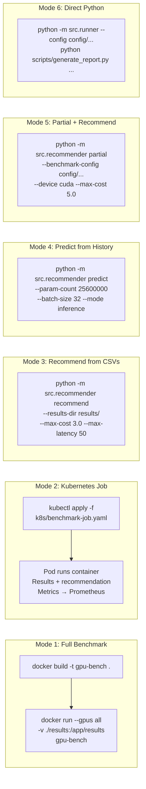

---

## 3. System Operating Modes

The system supports **three distinct operating modes**, each serving a different
stage of the GPU selection workflow:

### Mode 1: `recommend` — Analyse Existing Results

**When to use:** You already have benchmark data (from a full or previous run).

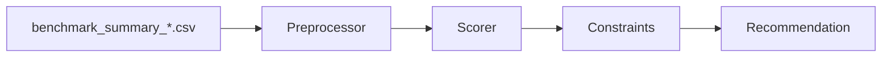

- Loads CSV results from a results directory
- Computes aggregate stats (mean throughput, CV, latency percentiles)
- Scores GPUs on three weighted axes: throughput (40%), cost-efficiency (35%), latency (25%)
- Filters by user constraints (budget, latency SLA)
- Produces ranked recommendation with human-readable reasoning

**CLI:**
```bash
python -m src.recommender recommend --results-dir results/ --max-cost 3.0 --max-latency 50
```

### Mode 2: `partial` — Quick-Profile Then Recommend

**When to use:** You want a recommendation but don't want to pay for full benchmark runs.

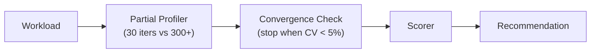

- Runs each workload for a limited number of iterations (default 30)
- Monitors per-iteration throughput in a sliding window
- Stops early when throughput stabilises (coefficient of variation < 5%)
- Estimates steady-state throughput with 95% confidence intervals
- Saves 5-10x cloud cost compared to full benchmark runs
- Still logs results to history for future prediction

**CLI:**
```bash
python -m src.recommender partial --benchmark-config config/benchmark_config.yaml --device cuda
```

### Mode 3: `predict` — Zero-Cost Estimation from History

**When to use:** You have a *new* model and want a GPU suggestion without running anything.

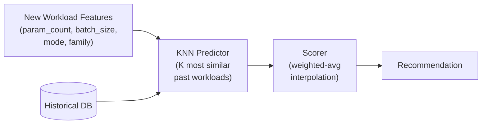

- Extracts features from the query: parameter count, batch size, mode, model family
- Finds K nearest neighbours in the history database by euclidean distance on normalised features
- Interpolates throughput, latency, and memory for each GPU type
- Reports confidence based on similarity distance (high = close match in history)
- Costs nothing — no GPU needed, runs on any machine

**CLI:**
```bash
python -m src.recommender predict --param-count 25600000 --batch-size 32 --mode inference --family vision
```

---

## 4. Detailed Workflow — Full Benchmark Pipeline

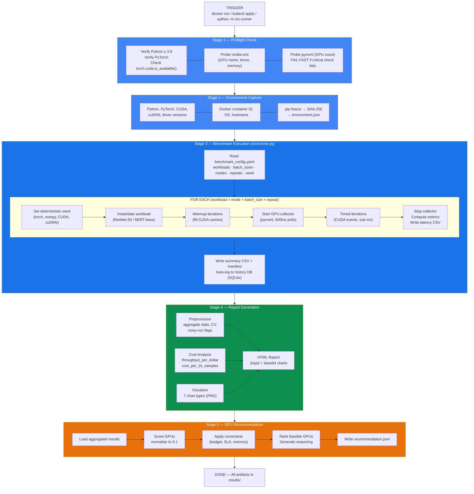

---

## 5. Detailed Workflow — Recommendation Engine

### Partial Benchmark Flow

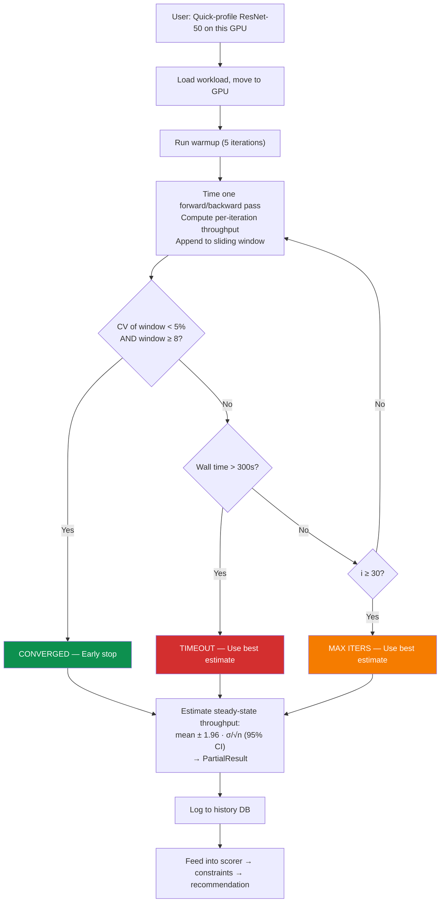

### Prediction Flow

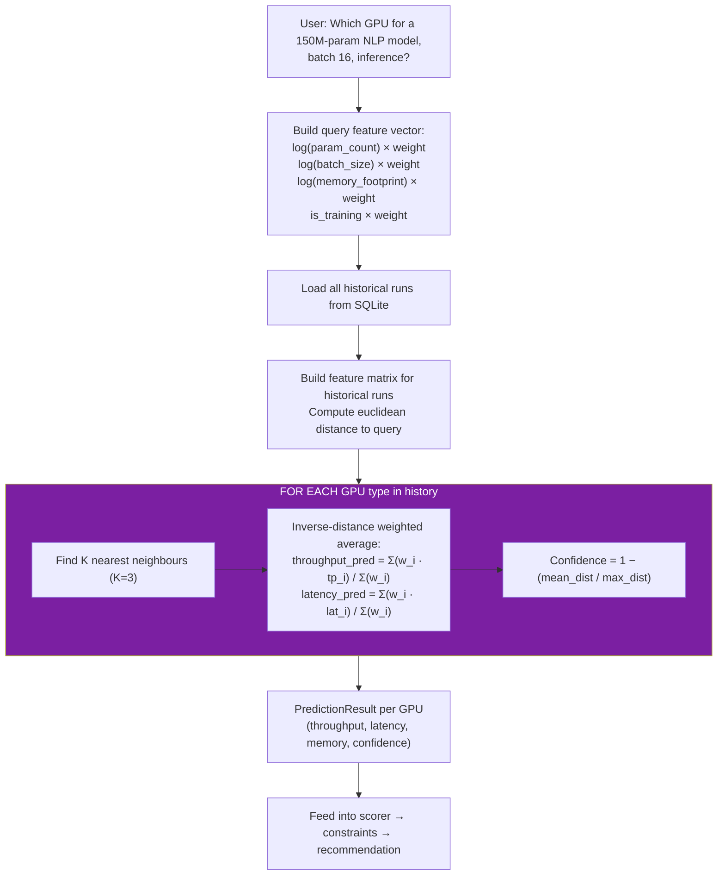

### Scoring Algorithm

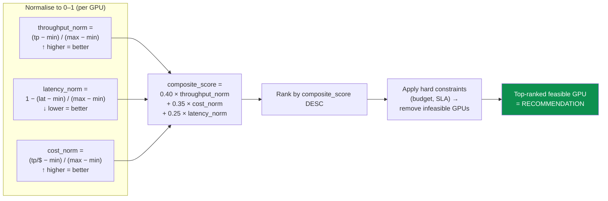

---

## 6. Directory Structure

```
gpu_cloud_benchmark/
|
|-- config/                              CONFIGURATION
|   |-- benchmark_config.yaml            Master benchmark parameters
|   |-- benchmark_config_local.yaml      Lightweight config for CPU testing
|   |-- gpu_cost_rates.yaml              Cloud GPU hourly pricing table
|   |-- recommendation_config.yaml       Scoring weights, partial settings, predictor config
|
|-- src/                                 CORE LIBRARY
|   |-- __init__.py
|   |-- runner.py                        Main benchmark orchestrator (--workload-target supported)
|   |
|   |-- workloads/                       ML WORKLOAD DEFINITIONS
|   |   |-- __init__.py                  Lazy registry + register_custom_workloads()
|   |   |-- base.py                      Abstract BaseWorkload contract
|   |   |-- vision.py                    ResNet-50 workload
|   |   |-- nlp.py                       BERT-base workload
|   |
|   |-- metrics/                         MEASUREMENT INFRASTRUCTURE
|   |   |-- __init__.py
|   |   |-- timer.py                     CudaTimer + WallTimer
|   |   |-- gpu_collector.py             Background GPU metric poller
|   |   |-- prometheus_exporter.py       Push metrics to Prometheus Pushgateway
|   |
|   |-- cost/                            COST ANALYSIS
|   |   |-- __init__.py
|   |   |-- calculator.py                Throughput-per-dollar math
|   |
|   |-- analysis/                        POST-RUN ANALYSIS
|   |   |-- __init__.py
|   |   |-- preprocessor.py              Aggregate CSVs, compute stats
|   |   |-- visualizer.py                Generate 7 chart types
|   |   |-- report_generator.py          Render HTML report
|   |
|   |-- reproducibility/                 REPRODUCIBILITY GUARANTEES
|   |   |-- __init__.py
|   |   |-- seed_manager.py              Pin all RNG seeds
|   |   |-- checksum.py                  SHA-256 of files and env
|   |   |-- env_capture.py               Snapshot runtime environment
|   |
|   |-- recommender/                     GPU RECOMMENDATION ENGINE (v2.0)
|   |   |-- __init__.py                  Public API exports
|   |   |-- __main__.py                  CLI: python -m src.recommender
|   |   |-- engine.py                    Main orchestrator (3 modes)
|   |   |-- partial.py                   Convergence-checked short runs
|   |   |-- history.py                   SQLite historical logging
|   |   |-- scorer.py                    Multi-criteria GPU scoring
|   |   |-- constraints.py               Budget/latency constraint filter
|   |   |-- predictor.py                 KNN workload-similarity predictor
|   |
|   |-- artifacts/                       CLOUD ARTIFACT UPLOAD (v3.0)
|       |-- __init__.py
|       |-- s3_uploader.py               Upload run artifacts to S3 with run-id/gpu-class prefix
|
|-- user_workloads/                      USER-DEFINED WORKLOADS (v3.0)
|   |-- __init__.py
|   |-- example_mlp.py                   Reference custom workload (synthetic MLP)
|   |-- template.py                      Boilerplate to copy when adding a workload
|
|-- scripts/                             EXECUTABLE SCRIPTS
|   |-- entrypoint.sh                   Docker ENTRYPOINT (6-stage pipeline)
|   |-- preflight_check.py              Validate GPU / driver / CUDA
|   |-- generate_report.py              CLI to produce report from CSVs
|   |-- build_push_ecr.sh               Multi-arch buildx + push to AWS ECR
|
|-- infra/                              CLOUD INFRASTRUCTURE (v3.0 — Sahil)
|   |-- README.md                       Infra quick-start
|   |-- terraform/
|   |   |-- envs/aws-gpu/               Composition: VPC + security + compute + S3
|   |   |-- modules/network/            VPC, subnets, IGW, route tables
|   |   |-- modules/security/           Security group, admin CIDRs
|   |   |-- modules/compute/            Controller + per-class GPU worker pools, S3, IAM
|   |-- kubernetes/
|   |   |-- base/namespace.yaml         ml-benchmark namespace
|   |   |-- base/benchmark-shared.yaml  ConfigMap with benchmark YAML
|   |   |-- base/benchmark-job.yaml     Job template (envsubst placeholders)
|   |   |-- monitoring/prometheus*.yaml Prometheus + Pushgateway
|   |-- scripts/                        End-to-end pipeline (provision -> teardown)
|   |   |-- run_pipeline.sh             Single dispatcher
|   |   |-- provision.sh                terraform apply
|   |   |-- bootstrap_cluster.sh        Wait for k3s, fetch kubeconfig
|   |   |-- deploy_benchmark_stack.sh   kubectl apply namespace+config+monitoring
|   |   |-- run_benchmark_job.sh        Render Job per GPU class + parallel apply + S3 sync + recommend
|   |   |-- log_costs.sh                aws ec2 describe-instances + S3 upload
|   |   |-- fault_injection.sh          cordon + drain + recover
|   |   |-- teardown.sh                 terraform destroy (cost protection)
|   |   |-- common.sh                   Shared helpers (k3s tunnel, inventory load)
|   |-- docs/infra-workflow.md          Lifecycle and fault-injection mechanics
|
|-- k8s/                                LEGACY KUBERNETES MANIFESTS (v1.0)
|   |-- prometheus/                     Original Prometheus configs (now superseded by infra/kubernetes/monitoring/)
|
|-- .github/                            CI/CD
|   |-- workflows/ci.yaml               python tests · terraform fmt+validate · docker build
|
|-- docs/
|   |-- final-validation-checklist.md   Local -> Docker -> AWS smoke -> final cloud-run sequence
|
|-- data/                               PERSISTENT DATA
|   |-- benchmark_history.db            SQLite history (auto-created)
|
|-- tests/                              UNIT TESTS (72 total)
|   |-- test_workloads.py               15 — workload shape, inference, training
|   |-- test_metrics.py                  4 — Timer accuracy, CUDA events
|   |-- test_cost.py                     5 — Cost formula validation
|   |-- test_reproducibility.py          9 — Seed determinism, checksums
|   |-- test_recommender.py             37 — engine, scorer, constraints, predictor, history
|   |-- test_prometheus_exporter.py      1 — Pushgateway gauges + no-op fallback
|   |-- test_s3_uploader.py              1 — S3 prefix + per-file upload
|
|-- notebooks/
|   |-- analysis.ipynb                  Interactive result exploration
|
|-- Dockerfile                          Container image (uses requirements-runtime.txt)
|-- requirements-runtime.txt            Container-only deps (no torch, base image has it)
|-- requirements.txt                    Local-dev deps (incl. torch)
|-- .dockerignore                       Exclude tests/notebooks from image
|-- .gitignore                          Excludes results/, *.db, infra state
|-- README.md                           Quick-start (local, Docker, k3s, custom workloads)
|-- PROJECT_PROGRESS.md                 Joint progress tracker
|-- DGX2_BENCHMARK_LOG.md              NVIDIA GB10 (DGX Spark) run log
|-- AWS_BENCHMARK_LOG.md                AWS A10G + T4 multi-GPU run log
|-- UPGRADED_PROPOSAL.md                Original proposal vs delivered system
|-- ARCHITECTURE.md                     This file
|-- report.html                         Cross-GPU comparison report (AWS run, 2026-04-25)
```

---

## 7. Component Reference

Every file in the project, what it does, why it exists, and how it connects
to the rest of the system.

### 7.1 Configuration (`config/`)

| File | Purpose |
|------|---------|
| `benchmark_config.yaml` | **Master config** that drives the entire benchmark. Defines which workloads to run (`resnet50`, `bert_base`), which batch sizes (`1, 8, 32, 64`), how many repeats (`3`), warmup/benchmark iterations (`10`/`100`), the random seed (`42`), modes (`inference`, `training`), output directory, and Prometheus pushgateway URL. Changing this single file changes what the benchmark measures. |
| `benchmark_config_local.yaml` | **Lightweight config** for quick local validation on CPU. Uses only `resnet50`, smaller batch sizes, 2 repeats, 5 iterations. |
| `gpu_cost_rates.yaml` | **Cloud GPU pricing table**. Maps GPU names (T4, V100, A10G, A100, H100, L4) to their AWS on-demand hourly rates, instance types, and GPU memory. Used by both the cost calculator and the recommendation scorer. |
| `recommendation_config.yaml` | **Recommendation engine config**. Scoring weights (throughput: 0.40, cost: 0.35, latency: 0.25), partial benchmark settings (max 30 iters, convergence window 8, CV threshold 5%, time budget 300s), predictor settings (K=3 neighbours, min 5 history entries, feature weights), and default constraint values. |

### 7.2 Core Library (`src/`)

#### Runner

| File | Purpose |
|------|---------|
| `runner.py` | **The central benchmark orchestrator**. Reads the benchmark config YAML, loops over every combination of (workload x mode x batch_size x repeat), and for each: sets deterministic seeds, instantiates the workload, runs warmup, starts GPU metric collection in a background thread, times each iteration with CUDA events, computes throughput and latency percentiles, writes per-run latency CSVs, and pushes summary metrics to Prometheus. After all runs, writes `benchmark_summary_{GPU}.csv`, `run_manifest.json`, and **auto-logs every result to the history database** for the recommendation engine. Supports `--recommend` flag to produce a GPU recommendation immediately after benchmarking. |

#### Workloads (`src/workloads/`)

| File | Purpose |
|------|---------|
| `__init__.py` | **Lazy workload registry**. Maps workload names to (module, class) tuples. Uses `importlib` to only import a workload when it is first requested — avoids loading `transformers` (2+ second import) when only ResNet is needed. Provides `get_workload(name, **kwargs)` as the single entry point. |
| `base.py` | **Abstract base class** (`BaseWorkload`). Defines the contract: `setup()`, `generate_batch()`, `run_iteration()`, `warmup()`, `get_metadata()`, `cleanup()`. Also contains `WorkloadMetadata` dataclass (name, param_count, input_shape, throughput_unit). Any new workload subclasses this. |
| `vision.py` | **ResNet-50 workload**. 25.6M params. Synthetic ImageNet input `(B, 3, 224, 224)`. Inference and training (CrossEntropyLoss + SGD). Reports images/sec. |
| `nlp.py` | **BERT-base workload**. 109.5M params. Synthetic tokens `(B, 512)` with attention masks. Inference and training (AdamW). Reports tokens/sec. |

#### Metrics (`src/metrics/`)

| File | Purpose |
|------|---------|
| `timer.py` | **Precision timing**. `CudaTimer` uses `torch.cuda.Event(enable_timing=True)` for sub-millisecond GPU kernel timing. Falls back to `WallTimer` (`time.perf_counter()`) on CPU. Both return `TimingResult(elapsed_ms, method)`. |
| `gpu_collector.py` | **Background GPU metric poller**. Daemon thread samples GPU state every 500ms via `pynvml` (fallback: `nvidia-smi`). Captures: utilization %, memory (MB), temperature (C), power (W), SM clock (MHz). Returns `GpuSnapshot` dataclass list. |
| `prometheus_exporter.py` | **Prometheus Pushgateway integration**. Gauges for throughput, latency_p95, gpu_utilization, gpu_memory, labeled by gpu_type/workload/batch_size. Gracefully no-ops when pushgateway URL is empty. |

#### Cost (`src/cost/`)

| File | Purpose |
|------|---------|
| `calculator.py` | **Cost-efficiency engine**. Loads GPU rates from YAML, computes: `throughput_per_dollar`, `cost_per_1k_samples`, `cost_efficiency_rank`. This is the metric cloud teams actually use for instance selection. |

#### Analysis (`src/analysis/`)

| File | Purpose |
|------|---------|
| `preprocessor.py` | **Data aggregation**. Loads `benchmark_summary_*.csv` files, groups by (gpu_type, workload, mode, batch_size), computes mean/std/min/max/CV, flags noisy groups (CV > 10%). |
| `visualizer.py` | **Chart generator**. 7 publication-quality visualizations: throughput bars, latency percentiles, throughput-vs-cost scatter, cost efficiency ranking, GPU utilization time-series, batch-size scaling curves, CV heatmap. |
| `report_generator.py` | **HTML report renderer**. Jinja2 template, charts embedded as base64, summary + cost tables, environment info. Single self-contained file. |

#### Reproducibility (`src/reproducibility/`)

| File | Purpose |
|------|---------|
| `seed_manager.py` | **Deterministic seeding**. Pins `random`, `numpy`, `torch`, CUDA, cuDNN. Enables `torch.use_deterministic_algorithms(True, warn_only=True)`. |
| `checksum.py` | **Artifact integrity**. SHA-256 of files, pip freeze, and directories. Stored in `run_manifest.json`. |
| `env_capture.py` | **Environment snapshot**. Python/PyTorch/CUDA/cuDNN/driver versions, GPU info, Docker container ID, pip freeze hash. |

#### Recommendation Engine (`src/recommender/`) — NEW

| File | Purpose |
|------|---------|
| `__init__.py` | **Public API**. Exports `RecommendationEngine`, `PartialProfiler`, `PartialResult`, `HistoryStore`, `WorkloadPredictor`, `PredictionResult`, `GpuScore`, `UserConstraints`, `score_gpus`, `apply_constraints`. |
| `__main__.py` | **CLI entry point**. `python -m src.recommender <mode>` with 5 subcommands: `recommend`, `partial`, `predict`, `import`, `history`. Each accepts constraint flags (`--max-cost`, `--max-latency`, `--min-throughput`) and an optional `--output` for JSON export. |
| `engine.py` | **Main orchestrator**. The `RecommendationEngine` class ties everything together. Three core methods: `recommend()` (analyse existing CSVs), `partial_and_recommend()` (run short benchmarks then recommend), `predict_and_recommend()` (KNN from history). Also: `import_results_to_history()` to ingest past runs. Contains `format_recommendation()` for pretty-printing and `save_recommendation_json()` for structured output. |
| `partial.py` | **Partial benchmark profiler**. `PartialProfiler` class. Runs a workload for up to `max_iterations` (default 30) with `warmup_iterations` (default 5). After warmup, monitors a sliding window of `convergence_window` (default 8) throughput values. Stops when CV drops below `convergence_cv_threshold` (default 5%) or `time_budget_seconds` (default 300) elapses. Returns `PartialResult` with estimated throughput, 95% confidence interval (z=1.96 normal approx), convergence status, and full latency/GPU metrics. `run_suite()` runs partial benchmarks for all workload/mode/batch_size combinations from config. Saves 5-10x vs full benchmarks. |
| `history.py` | **SQLite historical store**. `HistoryStore` class with two tables: `benchmark_runs` (all metrics per run, full or partial, with confidence bounds) and `recommendations` (query + result log). Write methods: `log_run()`, `log_benchmark_results()` (bulk from runner), `log_partial_result()`, `log_recommendation()`. Read methods: `get_all_runs()`, `get_runs_for_workload()`, `get_distinct_gpus()`, `get_latest_runs_per_gpu()`, `summary_stats()`. Database auto-creates on first use. |
| `scorer.py` | **Multi-criteria scoring engine**. Normalises throughput, cost-efficiency (throughput_per_dollar), and latency to [0, 1] using min-max scaling. Applies configurable weights (default: throughput 40%, cost 35%, latency 25%). Produces ranked list of `GpuScore` dataclasses with composite scores, per-axis scores, and human-readable reasoning. Handles both full and partial run data (annotating confidence). |
| `constraints.py` | **User constraint filter**. `UserConstraints` dataclass: `max_cost_per_hour`, `max_latency_p95_ms`, `min_throughput`, `max_gpu_memory_gb`. `apply_constraints()` partitions scored GPUs into (feasible, excluded) with per-GPU rejection reasons. Warns when all GPUs are excluded (constraints too restrictive). |
| `predictor.py` | **Workload-similarity predictor**. `WorkloadPredictor` class. Extracts features: `log(param_count)`, `log(batch_size)`, `log(memory_footprint)`, `is_training` — each weighted per config. Computes euclidean distance to all historical runs. For each GPU type, finds K nearest neighbours (default 3), uses inverse-distance weighted interpolation to predict throughput, latency, and memory. Confidence = 1 - (mean_distance / max_distance). Returns `PredictionResult` per GPU. `predict_with_cost()` augments predictions with cost metrics for direct scoring. |

#### Artifacts (`src/artifacts/`) — v3.0

| File | Purpose |
|------|---------|
| `s3_uploader.py` | **S3 upload helper**. `maybe_upload_results()` reads `BENCHMARK_ARTIFACT_BUCKET`, `BENCHMARK_RUN_ID`, `BENCHMARK_GPU_CLASS`, and `POD_NAME` from environment, builds a hierarchical S3 key prefix (`benchmark-runs/{run_id}/{gpu_class}/{pod_name}/`), and uploads every file under the results directory with content-type detection. Standalone CLI: `python -m src.artifacts.s3_uploader --results-dir results/`. Used by stage 6 of the Docker entrypoint. |

### 7.3 User Workloads (`user_workloads/`) — v3.0

| File | Purpose |
|------|---------|
| `__init__.py` | Marks `user_workloads` as a package so import paths like `user_workloads.example_mlp:ExampleMLPWorkload` resolve. |
| `example_mlp.py` | **Reference custom workload**. Synthetic 3-layer MLP (34K params) with feature/label generation, forward pass, and metadata. Used as a copy-paste starting point and a CPU smoke test. |
| `template.py` | **Boilerplate**. Minimal `BaseWorkload` subclass with stub methods. Copy this when adding a new workload. |

A custom workload is registered three ways:
1. **YAML**: add `custom_workloads: { my_model: "user_workloads.my_model:MyModelWorkload" }` to the benchmark config.
2. **CLI**: `python -m src.runner --workload-target user_workloads.my_model:MyModelWorkload`.
3. **Python API**: `from src.workloads import register_workload; register_workload("name", "module:Class")`.

### 7.4 Scripts (`scripts/`)

| File | Purpose |
|------|---------|
| `entrypoint.sh` | **Docker ENTRYPOINT**. Now a **6-stage** pipeline: (1) preflight, (2) env capture, (3) benchmark, (4) report, (5) GPU recommendation, (6) S3 upload. |
| `preflight_check.py` | **Fail-fast validator**. Checks Python, PyTorch, CUDA, nvidia-smi, pynvml. |
| `generate_report.py` | **Standalone report CLI**. Load CSVs, run analysis, generate HTML report. |
| `build_push_ecr.sh` | **Multi-arch image push to ECR**. Sets up `docker buildx`, logs into ECR, builds for `linux/amd64` (default), and pushes — essential when developing on Apple Silicon and deploying to AWS amd64 EC2. |

### 7.5 Cloud Infrastructure (`infra/`) — v3.0

The entire `infra/` tree is **Sahil's portion** of the project. It packages the cloud
provisioning, k3s cluster, K8s manifests, and lifecycle scripts.

#### Terraform modules (`infra/terraform/`)

| Path | Purpose |
|------|---------|
| `envs/aws-gpu/main.tf` | Wires the network + security + compute modules together; emits `inventory.json` consumed by the bash pipeline. |
| `envs/aws-gpu/variables.tf` | All knobs: region, AZs, subnet CIDRs, admin CIDR, AMI IDs, instance types, hourly rates, S3 bucket, **`worker_pools` list — one entry per GPU class** (e.g. `T4 / g4dn.xlarge / $0.526` and `A10G / g5.xlarge / $1.006`). |
| `modules/network/` | VPC (10.42.0.0/16), public subnets, IGW, route tables. |
| `modules/security/` | Security group rules — admin CIDR for SSH, intra-cluster ports for k3s + Prometheus. |
| `modules/compute/` | EC2 controller (k3s server) + dynamic per-GPU-class worker pools, S3 artifact bucket, IAM roles, cloud-init scripts. Pulls the latest official Ubuntu GPU DLAMI by SSM parameter so CUDA + nvidia-driver are pre-installed. |

#### Kubernetes manifests (`infra/kubernetes/`)

| File | Purpose |
|------|---------|
| `base/namespace.yaml` | `ml-benchmark` namespace. |
| `base/benchmark-shared.yaml` | ConfigMap that the benchmark pods mount as `benchmark_config.yaml`. Contains workload list, batch sizes, repeats, Pushgateway URL. |
| `base/benchmark-job.yaml` | **Job template with `${...}` placeholders** rendered by `envsubst`. One Job is created per GPU class: `nvidia.com/gpu: 1`, `runtimeClassName: nvidia`, `nodeSelector: gpu-benchmark/gpu-class=<CLASS>`, `imagePullSecrets: benchmark-registry-credentials` (auto-refreshed for ECR), `BENCHMARK_RESULTS_DIR=/artifacts/${GPU_CLASS}`. |
| `monitoring/prometheus.yaml` | Prometheus + Pushgateway Deployment/Service. Pushgateway scraped by Prometheus; exposes port 9091. |
| `monitoring/prometheus-configmap.yaml` | Prometheus scrape config. |

#### Pipeline scripts (`infra/scripts/`)

| Script | Verb | What it does |
|--------|------|--------------|
| `run_pipeline.sh` | dispatcher | Single entry point with 7 verbs (below). |
| `provision.sh` | `provision` | `terraform apply` and emits `inventory.json`. |
| `bootstrap_cluster.sh` | `bootstrap` | Opens an SSH tunnel to k3s controller, fetches `kubeconfig`, waits for nodes ready. |
| `deploy_benchmark_stack.sh` | `deploy` | `kubectl apply` namespace + ConfigMap + Prometheus stack. |
| `run_benchmark_job.sh` | `benchmark` | Renders Job per GPU class with `envsubst`, applies in parallel, `kubectl wait --for=condition=complete`, then **syncs results from S3, regenerates the consolidated `report.html` + `recommendation.json`, and re-uploads the comparison bundle**. |
| `log_costs.sh` | `log-costs` | `aws ec2 describe-instances` + per-instance metadata snapshot uploaded to S3. |
| `fault_injection.sh` | `fault-inject` | `kubectl cordon` -> `kubectl delete pod` -> `kubectl drain` -> wait 30s -> `kubectl uncordon` to measure recovery cost/time. |
| `teardown.sh` | `teardown` | `terraform destroy` to prevent runaway spend. |
| `common.sh` | (sourced) | Helpers: `require_cmd`, `ensure_k3s_tunnel`, `load_inventory`, `artifact_bucket`. |

### 7.6 CI/CD (`.github/workflows/ci.yaml`) — v3.0

Three jobs run on every push to `main` and every pull request:

| Job | Steps | Why |
|-----|-------|-----|
| `python` | Setup Python 3.11 → install CPU torch + `requirements.txt` → `pytest -q tests/` | Catch code regressions cheaply on CPU. |
| `terraform` | Setup Terraform 1.7.5 → `fmt -check -recursive` → `init -backend=false` → `validate` | Catch IaC syntax bugs before any `apply`. |
| `docker` | `docker buildx` build (no push) | Catch Dockerfile drift. |

The benchmark itself is deliberately **not** run in CI — see `PROJECT_PROGRESS.md` §9
for the rationale and recommended optional workflow extensions.

### 7.7 Legacy Kubernetes (`k8s/`)

| File | Status |
|------|--------|
| `k8s/prometheus/*` | **Superseded** by `infra/kubernetes/monitoring/`. Kept for reference; the active stack is in `infra/`. |

### 7.8 Tests (`tests/`)

| File | Tests | Purpose |
|------|------:|---------|
| `test_workloads.py` | 15 | Workload registry, output shapes, metadata, warmup, samples_per_batch, custom workload registration. |
| `test_metrics.py` | 4 | Timer accuracy, CUDA event fallback. |
| `test_cost.py` | 5 | Cost formula validation, ranking, edge cases. |
| `test_reproducibility.py` | 9 | Seed determinism, checksums, env capture. |
| `test_recommender.py` | 37 | history · scorer · constraints · predictor · engine · CLI. |
| `test_prometheus_exporter.py` | 1 | Pushgateway gauges + no-op fallback. |
| `test_s3_uploader.py` | 1 | S3 prefix construction + per-file upload (boto3 mocked). |
| **TOTAL** | **72** | |

### 7.9 Documentation Files

| File | Purpose |
|------|---------|
| `Dockerfile` | Container image: `nvcr.io/nvidia/pytorch:24.08-py3` base, installs `requirements-runtime.txt`, copies `src/`, `config/`, `scripts/`, `user_workloads/`. 6-stage entrypoint. |
| `.dockerignore` | Excludes tests, notebooks, results, .git from build context. |
| `.gitignore` | Excludes results, data/*.db, infra state files, kubeconfig, __pycache__, .DS_Store. |
| `requirements.txt` | Local-dev deps (incl. torch). |
| `requirements-runtime.txt` | Container-only deps (no torch, base image has it). Includes `boto3` for S3 uploads. |
| `README.md` | Quick-start: local, Docker, AWS k3s pipeline, custom workloads. |
| `PROJECT_PROGRESS.md` | Joint progress tracker (Rahul + Sahil). |
| `DGX2_BENCHMARK_LOG.md` | NVIDIA GB10 (DGX Spark) run log. |
| `AWS_BENCHMARK_LOG.md` | AWS A10G + T4 multi-GPU run log. |
| `UPGRADED_PROPOSAL.md` | Original proposal annotated with what was actually delivered. |
| `docs/final-validation-checklist.md` | Local → Docker → AWS smoke → final cloud-run sequence. |
| `infra/README.md` | Infra quick-start. |
| `infra/docs/infra-workflow.md` | Pipeline lifecycle and fault-injection mechanics. |
| `notebooks/analysis.ipynb` | Interactive Jupyter notebook for result exploration. |
| `report.html` | **Cross-GPU comparison report** from the April 25 AWS A10G + T4 run. |

---

## 8. Data Flow

### Full System Data Flow (v2.0)

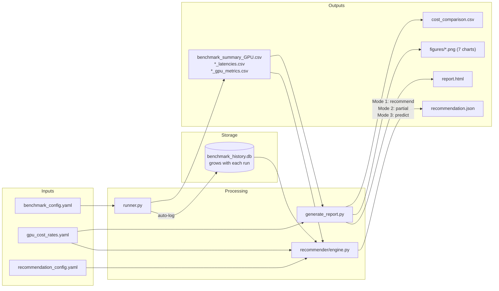

### Recommendation Engine Internal Data Flow

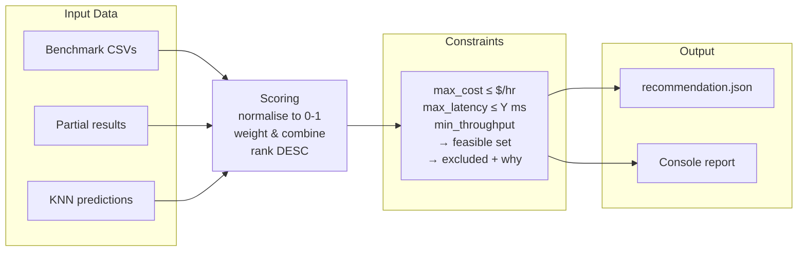

### History Growth and Prediction Accuracy

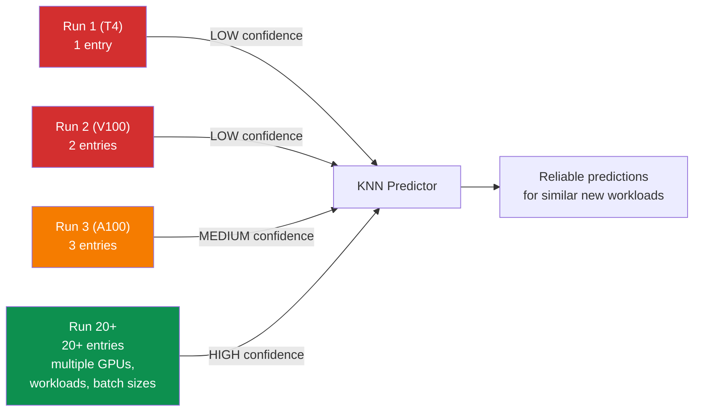

### Metric Flow to Prometheus/Grafana (K8s deployment)

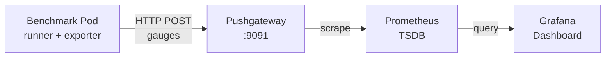

---

## 9. Configuration Reference

### benchmark_config.yaml

| Field | Type | Default | Description |
|-------|------|---------|-------------|
| `workloads` | list[str] | `[resnet50, bert_base]` | Workload names matching keys in `WORKLOAD_REGISTRY` |
| `batch_sizes` | list[int] | `[1, 8, 32, 64]` | Batch sizes to benchmark |
| `num_repeats` | int | `3` | Repeats per config for variance analysis |
| `warmup_iters` | int | `10` | Discarded warmup iterations |
| `benchmark_iters` | int | `100` | Timed iterations per run |
| `seed` | int | `42` | Base seed (each repeat uses seed + repeat - 1) |
| `modes` | list[str] | `[inference, training]` | Modes to benchmark |
| `output_dir` | str | `results/` | Output directory |
| `prometheus_pushgateway` | str | `""` | Pushgateway URL (empty = disabled) |

### recommendation_config.yaml

| Section | Field | Default | Description |
|---------|-------|---------|-------------|
| `scoring.weights.throughput` | float | `0.40` | Weight for raw throughput in composite score |
| `scoring.weights.cost_efficiency` | float | `0.35` | Weight for throughput-per-dollar |
| `scoring.weights.latency` | float | `0.25` | Weight for P95 latency (lower = better) |
| `scoring.optimization_goal` | str | `balanced` | `balanced`, `maximize_throughput`, or `minimize_cost` |
| `partial_benchmark.max_iterations` | int | `30` | Max iterations before stopping |
| `partial_benchmark.warmup_iterations` | int | `5` | Warmup before convergence tracking |
| `partial_benchmark.convergence_window` | int | `8` | Sliding window size for CV calculation |
| `partial_benchmark.convergence_cv_threshold` | float | `0.05` | CV below which = converged (5%) |
| `partial_benchmark.time_budget_seconds` | float | `300` | Wall-clock budget per profiling run |
| `partial_benchmark.batch_sizes` | list[int] | `[1, 32]` | Batch sizes for partial runs (subset) |
| `partial_benchmark.modes` | list[str] | `[inference]` | Modes for partial runs (subset) |
| `history.database_path` | str | `data/benchmark_history.db` | SQLite database location |
| `history.auto_log` | bool | `true` | Automatically log runs to history |
| `predictor.k_neighbors` | int | `3` | Number of nearest neighbours |
| `predictor.min_history_entries` | int | `5` | Minimum history rows to attempt prediction |
| `predictor.feature_weights.*` | float | varies | Weights for param_count, batch_size, memory, is_training |
| `constraints.defaults.*` | various | `null` | Default constraint values (null = no constraint) |

### gpu_cost_rates.yaml — Adding a New GPU

```yaml
gpu_rates:
  YOUR_GPU:
    instance_type: p5.48xlarge
    cost_per_hour: 12.29          # $/hr (or cost_per_gpu_hour for multi-GPU)
    gpu_memory_gb: 80
```

---

## 10. Extensibility Guide

### Adding a New Workload

1. Create `src/workloads/my_model.py`:

```python
from .base import BaseWorkload, WorkloadMetadata

class MyModelWorkload(BaseWorkload):
    def setup(self):         # load model, move to device
    def generate_batch(self): # return dict of input tensors
    def _forward(self, batch): # model forward pass
    def get_metadata(self):  # return WorkloadMetadata
```

2. Register in `src/workloads/__init__.py`:

```python
WORKLOAD_REGISTRY["my_model"] = (".my_model", "MyModelWorkload")
```

3. Add to `config/benchmark_config.yaml`:

```yaml
workloads:
  - resnet50
  - bert_base
  - my_model
```

No other changes needed. Runner, analysis, report, **and recommendation engine**
all automatically handle the new workload.

### Adding a New GPU to Cost Analysis

Add to `config/gpu_cost_rates.yaml`. The GPU name must match what
`torch.cuda.get_device_name()` returns (or the tag from `_detect_gpu_type()`).

### Adjusting Recommendation Weights

Edit `config/recommendation_config.yaml`:

```yaml
scoring:
  weights:
    throughput: 0.60        # prioritise raw speed
    cost_efficiency: 0.20   # less weight on cost
    latency: 0.20           # less weight on latency
```

Or use `minimize_cost` goal to auto-adjust for budget-conscious teams.

### Adding a New Chart

Add a function in `src/analysis/visualizer.py`, call it from
`generate_all_charts()`. It automatically appears in the HTML report.

### Growing the Predictor's Accuracy

The more benchmarks you run (across different GPUs, workloads, and configs),
the more accurate the KNN predictor becomes. Import old results:

```bash
python -m src.recommender import --results-dir results_old/
```

The predictor currently uses 4 features. To add more (e.g., FLOPs, model
depth), extend `_build_feature_vector()` in `predictor.py` and add the
feature weight to the config.

### Adding a Custom Workload

```bash
cp user_workloads/template.py user_workloads/my_model.py
# implement setup, generate_batch, _forward, get_metadata
python -m src.runner \
  --config config/benchmark_config_local.yaml \
  --device cpu \
  --workload-target user_workloads.my_model:MyModelWorkload \
  --workload-name my_model
```

Or register it permanently in YAML:

```yaml
custom_workloads:
  my_model: "user_workloads.my_model:MyModelWorkload"
workloads:
  - my_model
```

---

## 11. Cloud Pipeline (v3.0)

This section describes the production AWS pipeline that was used to generate the
April 25 multi-GPU comparison report. It glues Rahul's containerised benchmark
to Sahil's IaC + k3s infrastructure.

### 11.1 End-to-End Cloud Workflow

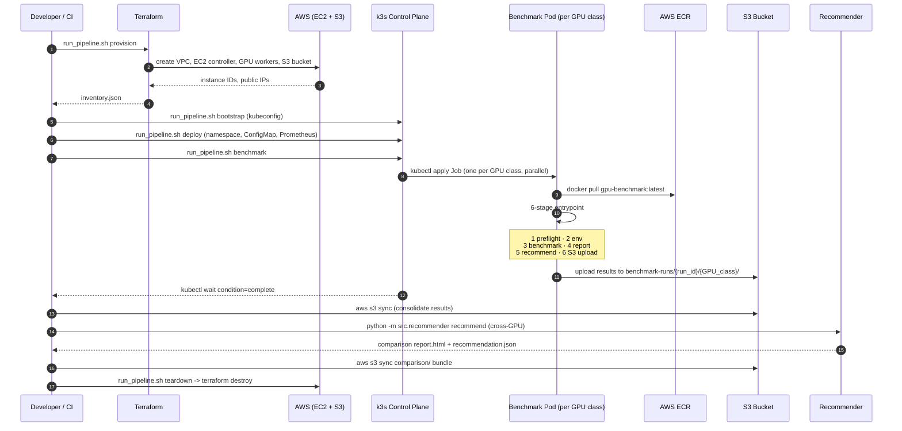

### 11.2 Why one Job per GPU Class (and not one Job that targets multiple)

Each Kubernetes Job in `infra/kubernetes/base/benchmark-job.yaml` is rendered
separately with `envsubst`, gets a unique `metadata.name`
(`benchmark-run-<gpu-class-lower>`), pins itself to a specific node pool with
`nodeSelector: gpu-benchmark/gpu-class=<CLASS>`, and writes its output to a
class-specific S3 prefix. This gives:

- **Parallelism**: T4 and A10G runs execute concurrently — wall-clock = max(per-class), not sum.
- **Fault isolation**: a kernel-level failure on T4 does not poison the A10G run.
- **Independent retry**: `backoffLimit: 1` per Job; one class can fail and re-launch.
- **Clean artifact paths**: `s3://<bucket>/benchmark-runs/<run-id>/<GPU_CLASS>/<pod-name>/` is the natural hierarchy for both per-pod logs and the consolidated comparison step.

### 11.3 The Image-Architecture Trap (and how `build_push_ecr.sh` solves it)

Apple Silicon laptops build `linux/arm64` images by default. AWS EC2 GPU
instances (g4dn, g5) are `linux/amd64`. A pod built for the wrong architecture
will fail with `exec format error`. `scripts/build_push_ecr.sh` always builds
for `linux/amd64` via `docker buildx --platform linux/amd64` and pushes
directly to ECR — this is the single command Sahil's pipeline assumes.

### 11.4 Cost Controls

| Control | Where | Effect |
|---------|-------|--------|
| `terraform destroy` after every run | `infra/scripts/teardown.sh` | Removes EC2 + S3 unless explicitly preserved |
| `ttlSecondsAfterFinished: 3600` | `benchmark-job.yaml` | Auto-cleans Jobs 1 hour after completion |
| `backoffLimit: 1` | `benchmark-job.yaml` | At most one retry to avoid runaway re-runs |
| Per-instance hourly rate baked into Terraform | `worker_pools` variable | Forces explicit cost acknowledgement when adding a GPU class |
| Cost snapshot uploaded to S3 | `log_costs.sh` | Audit trail of which instances ran when |

### 11.5 Observability

Two parallel telemetry channels operate during a run:

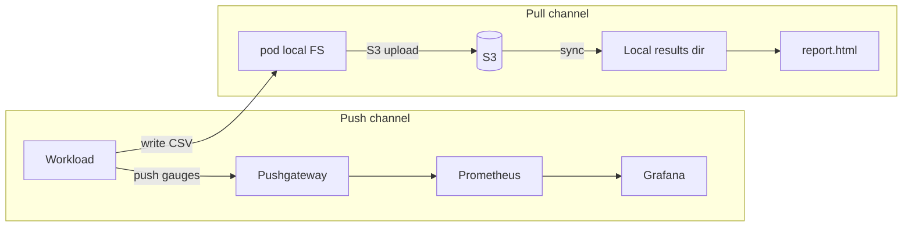

The push channel is **for live monitoring** during a run. The pull channel is
**the authoritative artifact store** — it's what the post-run recommender reads
and what any downstream report regeneration uses.

### 11.6 Where Rahul's Code Plugs Into Sahil's Pipeline

Five well-defined hand-off points:

| Hand-off | Producer (Sahil) | Consumer (Rahul) |
|----------|------------------|-------------------|
| Container image | ECR pushed by `build_push_ecr.sh` | `benchmark-job.yaml` `image:` field |
| Per-pod config | ConfigMap mounted at `/app/config/benchmark_config.yaml` | `src/runner.py` reads via `BENCHMARK_CONFIG` env var |
| GPU class label | `BENCHMARK_GPU_CLASS` env var | `src/artifacts/s3_uploader.py` builds prefix |
| Run ID | `BENCHMARK_RUN_ID` env var | Same — used for cross-run correlation |
| S3 bucket | `BENCHMARK_ARTIFACT_BUCKET` env var | `src/artifacts/s3_uploader.py` upload destination |

The consolidated comparison step (post-`kubectl wait`) is where the two halves
meet again: `aws s3 sync` pulls every pod's artifacts back, then
`python -m src.recommender recommend` runs across the union to emit the
final cross-GPU `recommendation.json`.

---

## 12. Cross-Cloud Validation (v3.1)

### 12.1 Unified History Database

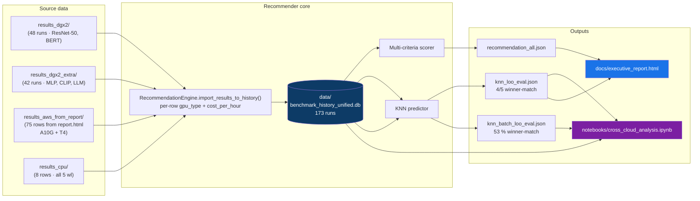

### 12.2 Quantitative Recommender Validation

The KNN no-run predictor (Mode 3) is the project's central novelty. We validated it
empirically with two held-out experiments:

| Experiment | What's held out | Script | Result |
|------------|------------------|--------|--------|
| Leave-one-workload-out | All rows for 1 of 5 workloads | `scripts/eval_knn_holdout.py` | **4 / 5 (80 %)** winner-match |
| Leave-one-batch-out    | One (workload, mode, bs) tuple at a time, 30 scenarios | `scripts/eval_knn_batch_holdout.py` | 53 % overall winner-match |

Both scripts are reproducible against the unified DB and emit JSON reports under
`results_eval/`. The full validation write-up — including throughput / latency error
distributions and per-workload analysis — lives in `RECOMMENDER_EVALUATION.md`.

**Bottom line:** even when the recommender has *never* seen a workload before, it
picks the right GPU 4 out of 5 times using only `param_count`, `batch_size`, `mode`,
and `family` as inputs. That validates the headline product claim.

### 12.3 Reporting Pipeline

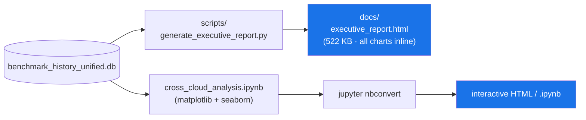

The notebook is for exploration; the executive report is for hand-off (single file,
no dependencies, opens offline). Both consume the same unified DB so they cannot
disagree.

### 12.4 Cost-Rate Re-baseline

In v3.0, GB10 was costed at $0.15/h (purchase price ÷ 3 yr × 730 h). With that rate,
GB10 trivially won every per-dollar comparison and the recommendation looked biased.
In v3.1, the rate was rebuilt from a fully-loaded TCO model:

```
hardware     : $3,999 / (3y · 8,760h · 0.70 utilisation) = $0.218 / h
power        : 240 W avg · $0.13 / kWh                    = $0.031 / h
install      : $500 labour amortised over the same period = $0.027 / h
space + cooling + maintenance (≈10 % of hardware)         = $0.022 / h
                                                            ────────
fully-loaded                                              ≈ $0.30 / h
```

This is documented inline in `config/gpu_cost_rates.yaml` and produces a much fairer
recommender output (A10G wins 4 modes, GB10 wins 4 — see PROJECT_PROGRESS §12).

### 12.5 What the validation does NOT cover

- **Fresh fault-inject replay + live Grafana UI.** Scripts and manifests exist
  (`fault_injection.sh`, monitoring stack), but this wrap-up treats them as
  optional follow-ups. The published AWS benchmark artefact is **`report.html`**
  (see `PROJECT_PROGRESS.md` §10.4).

- **A100 / H100 large-GPU runs.** Out of scope for the academic deliverable; the
  pipeline supports them with no code change (only `terraform.tfvars` updates).

- **Sub-millisecond latency tracing.** The current `latency_p95_ms` floor is the
  CUDA-stream synchronisation cost; useful but not enough for true online-serving
  latency budgets. Argo Workflows + per-request tracing is future work.
